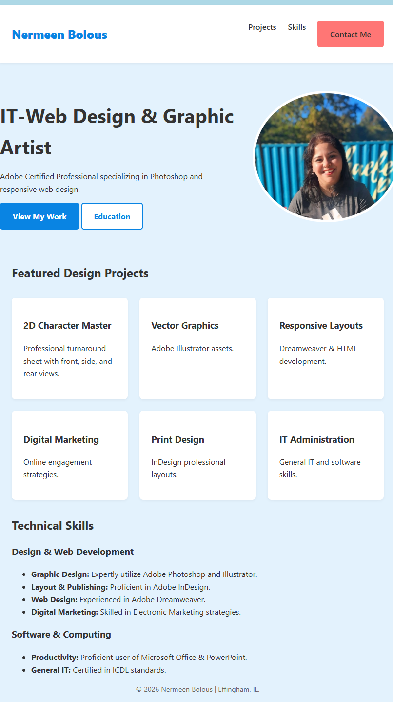
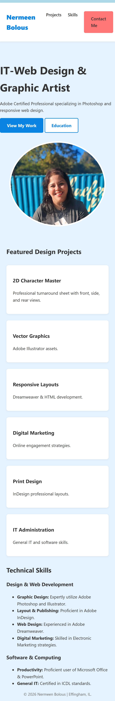

# my-portfolio-landing
# Portfolio Landing Page - Nermeen Bolous

A responsive, mobile-first portfolio landing page built as part of my IT-Web Design coursework. This project showcases my professional certifications, technical skills, and educational background at Lake Land College.

## Project Goal
The goal of this assignment was to recreate a landing page layout (Mockup B: Portfolio) using modern CSS techniques like Flexbox and CSS Grid, while maintaining accessibility and a consistent design scale.

## Features
* **Mobile-First Design:** Optimized for small screens first, then scaling up for desktop.
* [cite_start]**CSS Grid:** Utilized for the "Featured Design Projects" section to create a dynamic 3-column layout[cite: 9, 11].
* **Flexbox:** Used for the navigation bar and hero section alignment.
* **Accessibility:** Includes semantic HTML tags, logical heading orders, and alt text for all images.
* **Branding:** Features a custom light blue theme with bold branding for "Nermeen Bolous."

## Technical Skills Showcased
[cite_start]Based on my professional background[cite: 3, 7]:
* [cite_start]**Graphic Design:** Adobe Photoshop & Illustrator[cite: 13, 19].
* [cite_start]**Web Development:** Adobe Dreamweaver & HTML/CSS[cite: 21].
* [cite_start]**Layout:** Adobe InDesign[cite: 20].
* [cite_start]**Productivity:** Microsoft Office Specialist (PowerPoint)[cite: 16, 24].
* [cite_start]**General IT:** ICDL Certification[cite: 15, 25].

## Education
* [cite_start]**Lake Land College**: Associate of Applied Science – IT- Web Design Administration (Expected 05/2026)[cite: 8, 9, 11].

## Screenshots

### Desktop View

### Mobile View

## Links
* **GitHub Repository:** [Insert Link Here]
* **GitHub Pages Live Site:** [Insert Link Here]
